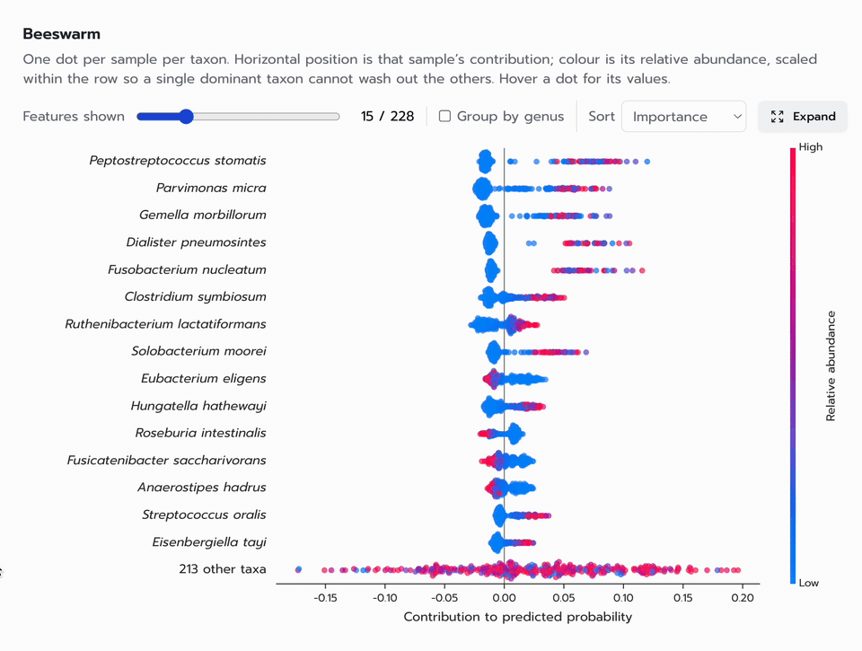
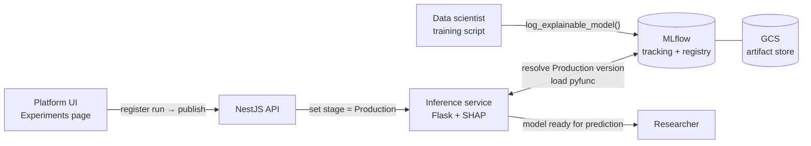
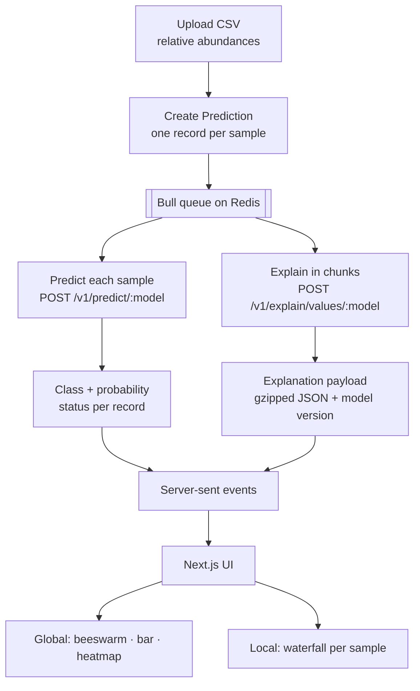
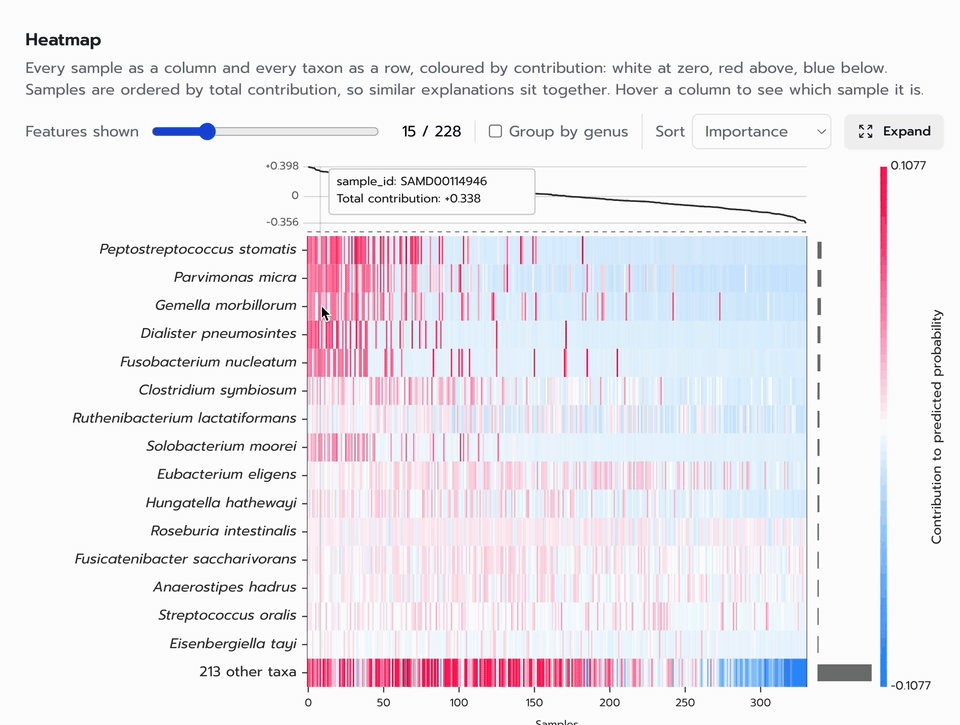
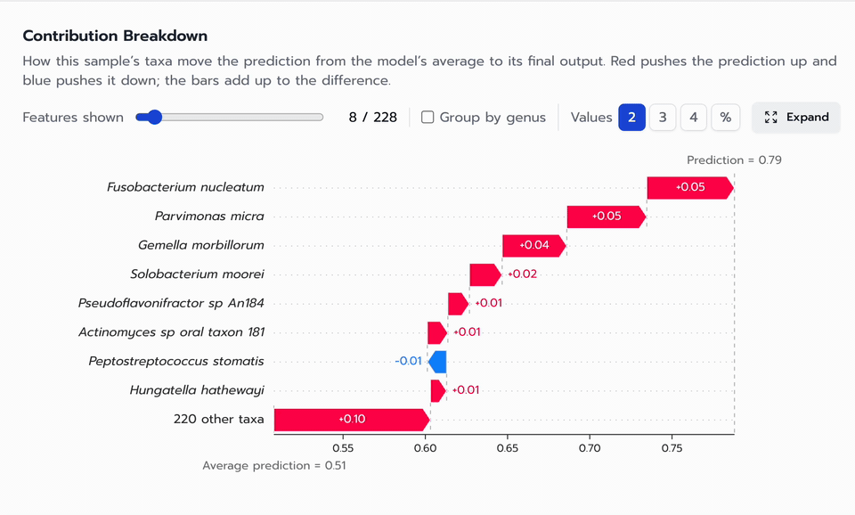
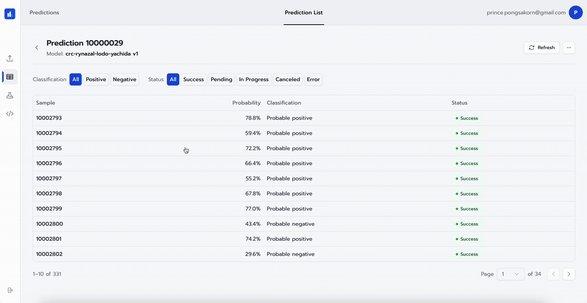
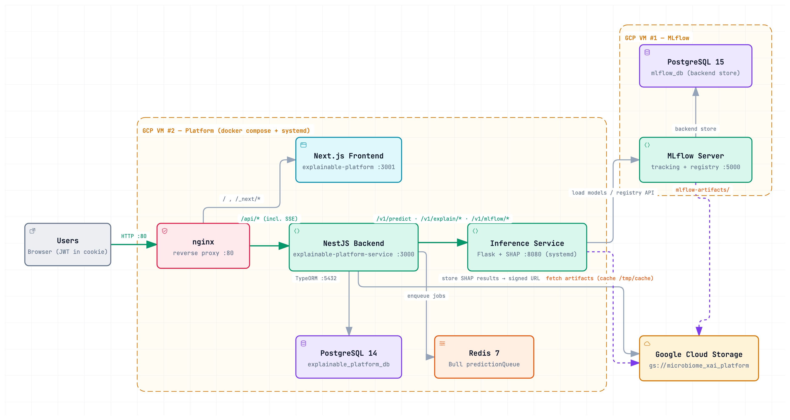

# Explainable AI Microbiome Platform

**Development of an Explainable AI Platform Using SHAP and Machine Learning via a Usecase of Predicting Diseases from Gut Microbiome Data**

A platform for predicting disease from gut-microbiome data that explains each prediction. A data scientist trains a model in any framework and publishes it in one click. A researcher uploads a CSV of relative abundances and gets a predicted class, a probability and a SHAP explanation for every sample, drawn as interactive charts.



## Highlights

- **Every model ships with its own explainer.** A model and its SHAP explainer are logged to MLflow as one artifact, so the prediction and its explanation always come from the same version.
- **Works with any framework.** Random Forest, XGBoost and a PyTorch Graph Convolutional Network all run on the same inference service. It needs no framework-specific code.
- **Publishing needs no redeploy.** Moving a run to `Production` from the web UI makes it live. The inference service reads the registry and loads the new version by itself.
- **Every prediction records its model version.** Each result stores the exact model version that produced it.
- **Charts are interactive.** Beeswarm, bar and heatmap charts give a global view, and a waterfall chart explains a single sample. The charts are SVG, drawn in the browser by [`shap-svg`](https://github.com/princepongsakorn/shap-svg).
- **Two taxonomic levels.** You can read an explanation per species or per genus. The genus view sums each genus's SHAP values and abundances.
- **Live progress.** Predictions run as background jobs, and the page updates over server-sent events while they run.

---

## Model deployment flow

The path from a training script to a model a researcher can use.



### 1. Train and log an explainable model

The platform's Developer page shows the MLflow tracking URI and an access token. A training script in `mlflow-experiments/` trains a model as usual. It then calls [`mlflow_explainable`](mlflow-experiments/extension/mlflow_explainable), a small library written for this project:

```python
from mlflow_explainable import log_explainable_model

model = xgb.XGBClassifier(eval_metric="logloss").fit(X_train, y_train)

with mlflow.start_run():
    mlflow.log_metric("roc_auc", roc_auc)
    log_explainable_model(
        model,
        X_train,                      # background data for the explainer
        registered_name="sample-xgboost-crc",
        extra_pip_requirements=["xgboost"],
    )
```

`log_explainable_model` builds the SHAP explainer that suits the model: TreeExplainer for tree ensembles, or a permutation explainer for a custom PyTorch GCN. It saves the predictor and the explainer together as **one self-contained `mlflow.pyfunc` artifact**. The source files of custom classes, such as a GCN wrapper, go into the artifact too, so the serving side never has to import them.

Every artifact has the same two methods:

| Method | Returns |
|---|---|
| `predict(X)` | probability and predicted class for each sample |
| `shap_explain(X)` | `values`, `base_values`, `data`, in the same shape for every explainer |

### 2. Review, register and publish

The **Experiments** page lists each MLflow run with its parameters and metrics (accuracy, precision, recall, F1, ROC AUC). From there a user can:

1. **Register** a run as a named model version.
2. **Publish** it, which moves that version to the `Production` stage.
3. **Unpublish** it, which moves it back to `None`, when it should be withdrawn.

### 3. Served automatically

The inference service loads models by name from `models:/<name>/<Production version>`. It never needs to know which framework is behind a model.

- It caches the version lookup and refreshes it in the background, so a promotion goes live without a restart and no request waits on the registry.
- It keeps loaded models in memory, because unpickling a model can take hundreds of MB.
- If MLflow cannot be reached, it keeps serving the last known version. It returns a clear 404 only when the registry confirms that no version is in `Production`.

Published models then appear on the prediction page.

---

## XAI pipeline

What happens when a researcher submits samples.



1. **Upload.** The researcher uploads a CSV of taxa (`Genus_species` columns) and picks a published model. The API parses the file and creates one **Prediction** with a **Prediction Record** per sample. The inference service later lines the columns up with the model's features: it drops extra columns, fills missing ones with 0 and puts them in training order.
2. **Queue.** The work goes on a Bull queue backed by Redis, so a large batch never blocks the API. A job can be cancelled, run again, or have a single chart regenerated.
3. **Predict.** Each record is sent to the inference service, which returns the predicted class and probability. Each record's status (in progress, success, error, cancelled) is stored and pushed to the browser.
4. **Explain.** The samples go to the SHAP endpoint in chunks. A sample's SHAP values do not depend on the other samples in its request, so the chunks can be joined without changing any value, and a failed chunk is retried on its own. The result is stored as one **Explanation payload**:
   - Its fields use `shap.Explanation`'s own names (`values`, `base_values`, `data`, `feature_names`), so any Python SHAP user can produce one.
   - Values keep four significant figures, which is finer than an 800 px chart can show and makes the JSON much smaller.
   - It records the exact model version that produced it.
   - It can be read per species or per genus.
5. **Visualise.** The frontend draws the payload with `shap-svg`:
   - **Global explanation.** A beeswarm and a bar chart show which taxa drive predictions across the batch, and a heatmap shows every sample against every taxon.
   - **Local explanation.** A waterfall chart shows how one sample's taxa move the prediction from the average (base value) to its final output.

   Each record also has a comment field for the researcher's notes.







---

## Architecture

### System infrastructure

<picture>
  <source media="(prefers-color-scheme: dark)" srcset="docs/assets/architecture-dark.png">
  
</picture>

| Layer | Stack | Directory |
|---|---|---|
| Frontend | Next.js, React, shadcn/ui, Tailwind, `shap-svg` | [`explainable-platform/`](explainable-platform) |
| API and job queue | NestJS, TypeORM + PostgreSQL, Bull + Redis, JWT auth | [`explainable-platform-service/`](explainable-platform-service) |
| Inference and SHAP | Flask, MLflow pyfunc, SHAP | [`kserve-custom-runtime/`](kserve-custom-runtime) |
| Model registry | MLflow (PostgreSQL backend, GCS artifact store) | [`deployment/`](deployment) |
| Training and model contract | scikit-learn, XGBoost, PyTorch Geometric, `mlflow_explainable` | [`mlflow-experiments/`](mlflow-experiments) |
| Load tests | k6 | [`k6/`](k6) |

**Deployment (GCP).** MLflow and its PostgreSQL database run on one VM, with artifacts in a GCS bucket. The inference container runs as a systemd service. The API, frontend, PostgreSQL and Redis run under Docker Compose behind nginx ([`docker-compose.prod.yml`](docker-compose.prod.yml)). Kubernetes manifests for a KServe deployment are kept in [`kserve-custom-runtime/deployment/`](kserve-custom-runtime/deployment) as the path to a larger deployment.

### Example models

| Registered model | Algorithm | Explainer |
|---|---|---|
| `sample-rf-crc` | Random Forest | TreeExplainer |
| `sample-xgboost-crc` | XGBoost | TreeExplainer |
| `sample-gcn-crc` | Graph Convolutional Network (PyTorch Geometric) | Permutation |
| `crc-curatedcrc-rf` | Random Forest on curatedMetagenomicData CRC cohorts | TreeExplainer |

All of them predict colorectal cancer (CRC) from species-level relative abundance.
